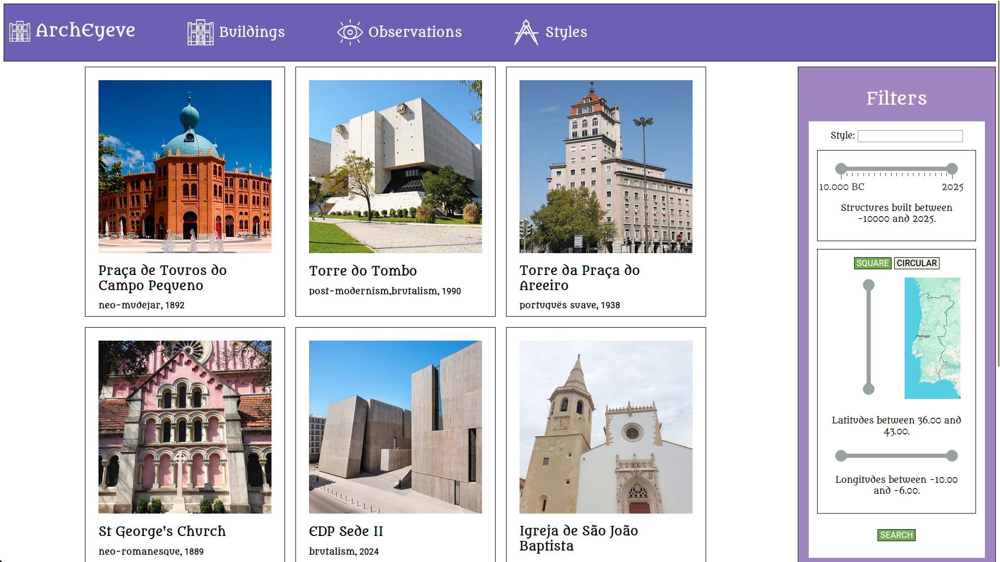
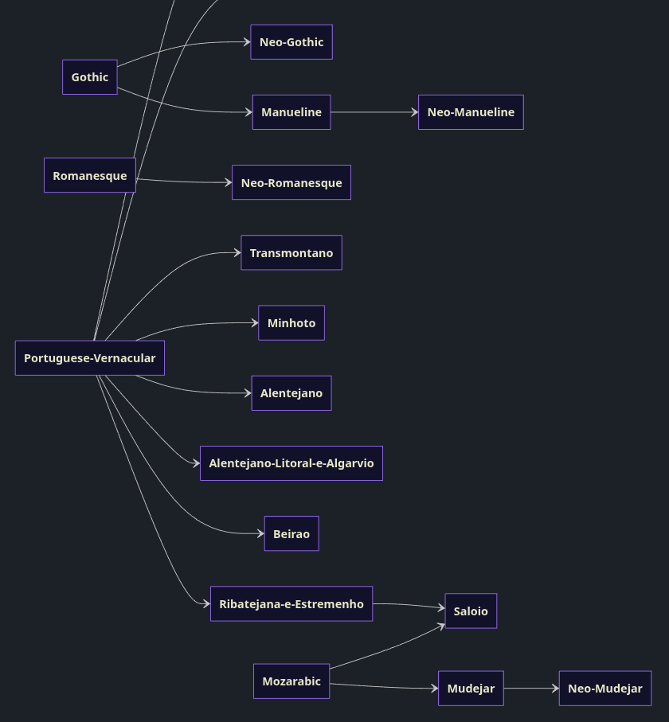

# ArchEyeve
ArchEyeve is social media and cataloging system for architecture enthusiasts. It was inspired by the popular biology cataloging website iNaturalist. 

> [!WARNING]
> This is a work in progress

## Features

- Posting observations of buildings optionally including identification data such as architectural style, year built, etc
- Commenting and correcting other user's observations to make them more accurate
- Search with advanced parameters
- De-duplication and consolidation mechanisms for buildings with many observations
- Categorization of architectural styles with artistic evolutionary lineage

## Interface

Here is an overview of the home page of ArchEyeve. Individual user's observations are joined into a single "Building" that contains the consolidated data.

## The Idea

My original idea for this project was to create a catalog of structures in such a way that they are searchable through an "evolutionary tree" of architectural styles.

Below is a segment of the graph that represents all of the connections. An arrow from A -> B represents that B evolved or was influenced by style A.

For example, when "Romanesque" is searched, all observations of Romanesque and it's descending styles (Neo-Romanesque) are listed.

