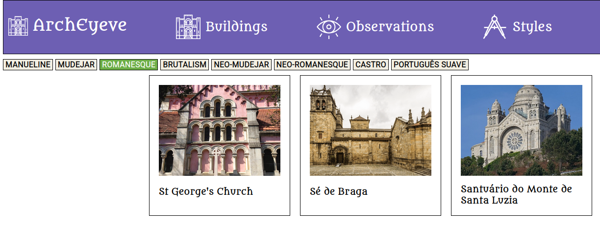

# ArchEyeve
ArchEyeve is social media and cataloging system for architecture enthusiasts. It was inspired by the popular biology cataloging website iNaturalist. 

> [!WARNING]
> This is a work in progress

## Features

- Posting observations of buildings optionally including identification data such as architectural style, year built, etc
- Commenting and correcting other user's observations to make them more accurate
- Search with advanced parameters
- De-duplication and consolidation mechanisms for buildings with many observations
- Categorization of architectural styles with artistic evolutionary lineage

